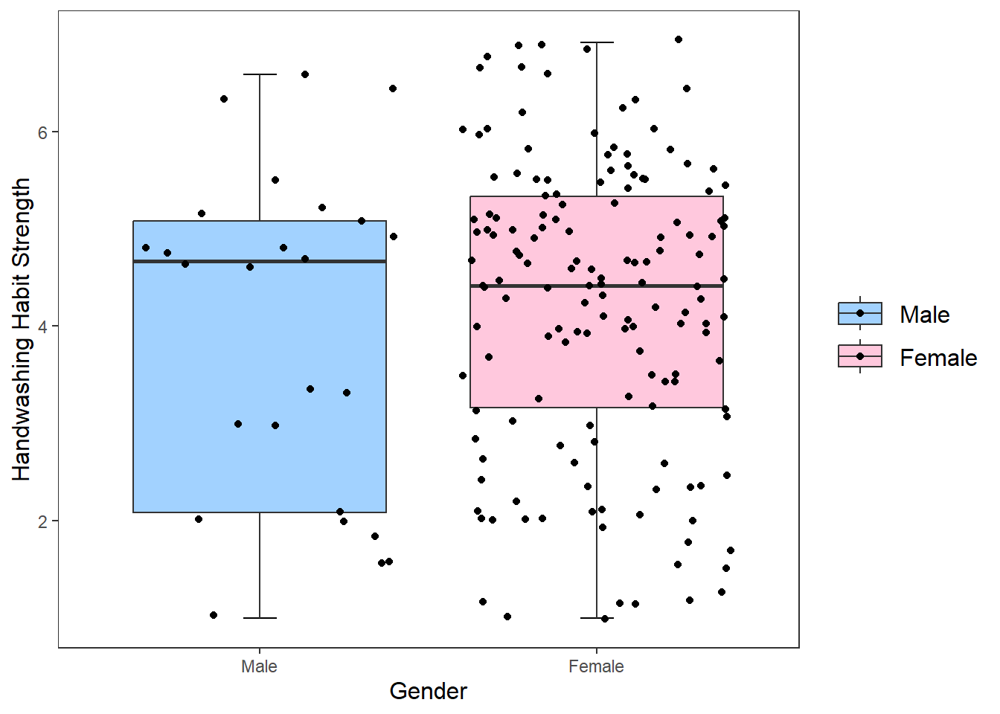
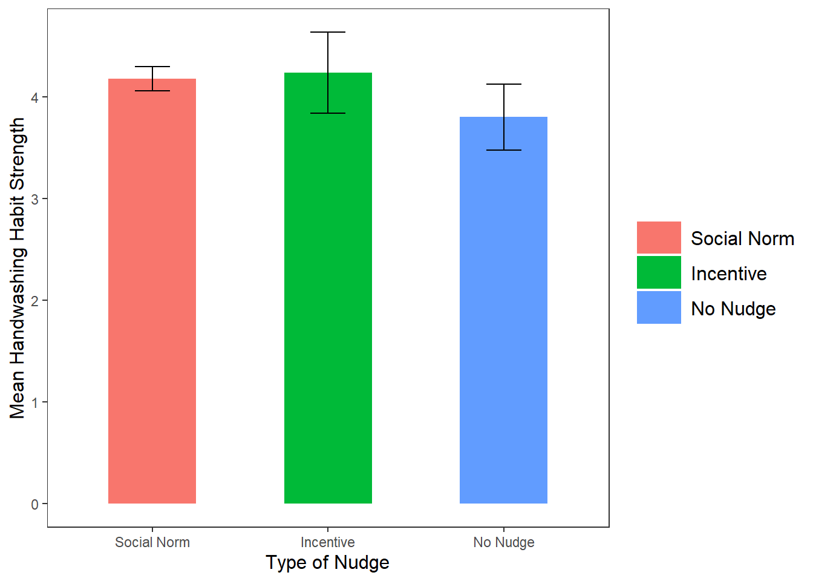
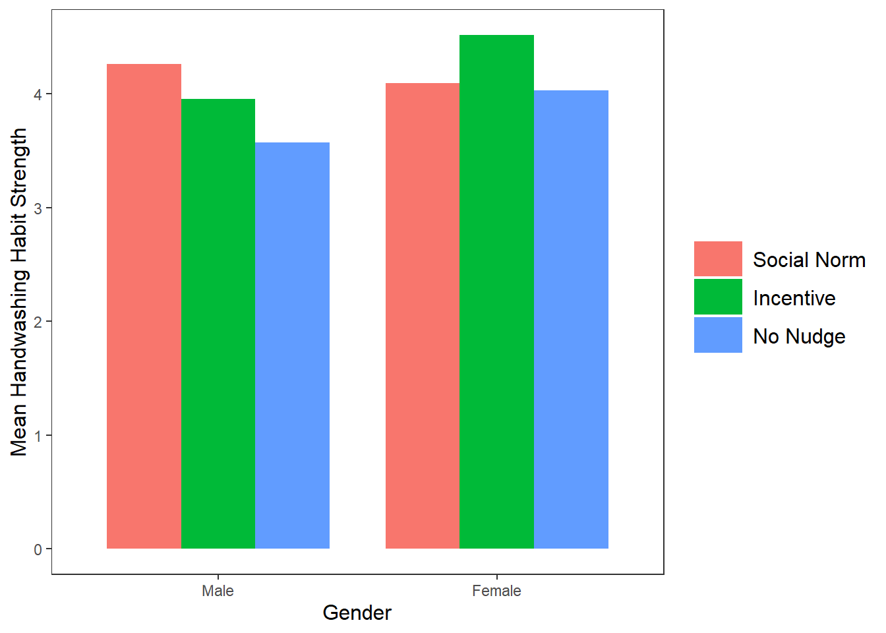
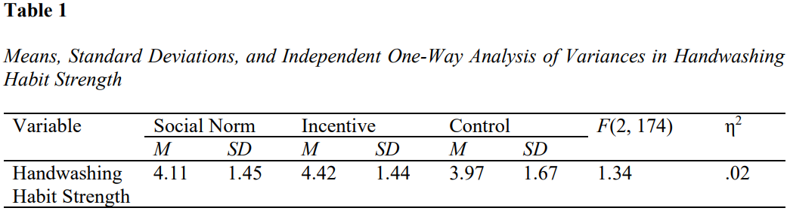

# Make it a habit: The effect of nudges on habitual handwashing behavior


[](https://university.help.edu.my/wp-content/uploads/2025/05/JAPP-007-R2-Final-Version-Updated.pdf)

## 📌 Abstract
Despite the critical importance of hygiene, public health compliance often wanes over time. This research explores the efficacy of **digital nudges**—specifically social norm and incentive-based cues—delivered via digital displays to foster long-term handwashing habits.

In a between-subjects experimental study involving **178 participants**, I investigated whether subtle context changes could influence the **Self-Report Habit Index (SRHI)** scores over a one-month intervention period. While the results indicated non-significant differences between conditions, the study provides a vital technical foundation for using **behavioral economics** and **Big Data** to design more effective, personalized health interventions.

---

## 📂 Methodology & Experimental Design
The study was structured to compare two different behavioral "frames" against a control group to see which most effectively bridged the gap between intention and habit.

* **Experimental Framework**: 1-IV 3-Levels Between-Subjects.
* **Intervention**: Weekly digital nudge delivery via high-salience digital posters for 30 days.
* **Reliability**: The SRHI scale demonstrated exceptional internal consistency (**Cronbach’s Alpha = .964**).

---

## 📈 Exploratory Data Analysis (EDA)
EDA was conducted in **R** to assess data distributions and demographic influences across experimental groups using ```tidyverse``` and ```ggplot2```.

### 1. Habit Strength by Gender
To determine if gender played a moderating role in baseline habit strength, a jittered boxplot was generated.
```r
# Boxplot of SRHI scores by gender
ggplot(data, aes(x = gender_cat, y = SRHI_Avg, fill = gender_cat)) +
  stat_boxplot(geom = "errorbar", width = 0.1) +
  geom_boxplot() +
  labs(
    x = "Gender", 
    y = "Handwashing Habit Strength", 
  ) +
  scale_fill_manual(values = c("#a2d2ff", "#ffc8dd")) +
  geom_jitter() +
  theme_apa()
```

*Figure 1: Comparison of SRHI scores across gender.*

### 2. Habit Strength by Nudge Condition
To analyze the effect and relationship of nudges on habit strength, a barplot was generated.
```r
# Barplot of SRHI distribution across experimental groups
ggplot(summary_data, aes(x = nudge_cat, y = mean_value, fill = nudge_cat)) +
  geom_bar(stat = "identity", position = "dodge", width = 0.50) +
  geom_errorbar(aes(ymin = mean_value - sd_value, ymax = mean_value + sd_value),
                position = position_dodge(0.60), width = 0.2) + 
  labs(x = "Type of Nudge", y = "Mean Handwashing Habit Strength") +
  theme_apa() 
```

*Figure 2: Comparison of SRHI scores across Social Norm, Incentive, and Control groups.*

### 3. Habit Strength by Nudge Condition across Gender
To uncover potential gender differences in the effect of nudges on habit strength, a barplot was generated.
```r
# Barplot of SRHI distribution across experimental groups by gender
ggplot(mean_data, aes(x = gender_cat, y = mean_SRHI_Avg, fill = nudge_cat)) +
  geom_bar(stat = "identity", position = "dodge", width = 0.80) +
  labs(x = "Gender", y = "Mean Handwashing Habit Strength") +
  theme_apa()
```

*Figure 3: Distribution of SRHI scores by experimental groups across gender identities.*

---

## 🧠 Statistical Analysis & Results (SPSS)
A One-Way ANOVA was executed to test the primary hypothesis. Despite the theoretical strength of nudging, the data suggested that static digital cues had a negligible effect on habit formation in this specific population.

### Inferential Statistics


**Key Findings:** 
* The differences between the Social Norm ($M$=4.11, $SD$=1.45), Incentive ($M$=4.42, $SD$=1.44), and Control ($M$=3.97, $SD$=1.67) groups were not statistically significant ($p$ = .265). This "null" result highlights the limitations of **passive digital interventions** compared to active, context-aware nudging.
* The observed effect size was extremely small (η2 = .02), suggesting that the intervention accounted for 2% of the variance in behavior after removing variance explained by other factors.

---

## 📊 Results Interpretation
* **Nudge Fatigue**: The lack of significance may be attributed to "digital clutter," where participants become desensitized to static email/poster nudges over a 30-day period.

* **Ceiling Effect**: Baseline hygiene awareness among undergraduate students may already be high, leaving little room for a simple nudge to create measurable "habit" growth.

### Assumption Checks
* **Normality**: Stem-and-leaf plots and Q-Q plots confirmed that habit strength scores followed a normal distribution across all levels.
* **Homogeneity of Variance**: Levene’s test was non-significant ($p$ > .05), ensuring the robustness of the ANOVA results.

---

## 🎯 Strategic Recommendations for Digital Health Design
To improve the efficacy of behavioral interventions, future strategies should transition from **Static Nudges** to **Dynamic Data Pipelines**:

1.  **Context-Aware Nudging**: Integrate IoT sensors (e.g., smart soap dispensers) to trigger nudges *at the moment of choice* rather than via weekly emails.
2.  **User Segmentation**: Apply clustering to identify "Nudge-Resistant" vs. "Nudge-Responsive" personas to personalize delivery frequency.
3.  **Reinforcement Learning**: Implement an RL-agent to optimize nudge framing based on real-time participant engagement data.

---

## 📖 Publication Detail
This research has been formally published in the **Insight: The Journal of Asian Perspectives on Psychology (JAPP)**. It contributes to the growing body of literature on the limitations and potential of digital behavioral interventions in a post-pandemic landscape.

**Citation:**
Tang, R. (2024). Make it a habit: The effect of nudges on habitual handwashing behavior. *Insight: The Journal of Asian Perspectives on Psychology (JAPP)*, *2*(1), 16-31. 

**Full Manuscript:**
[Read the paper here](https://university.help.edu.my/wp-content/uploads/2025/05/JAPP-007-R2-Final-Version-Updated.pdf)

---
*© 2026 Ryan Tang.*
